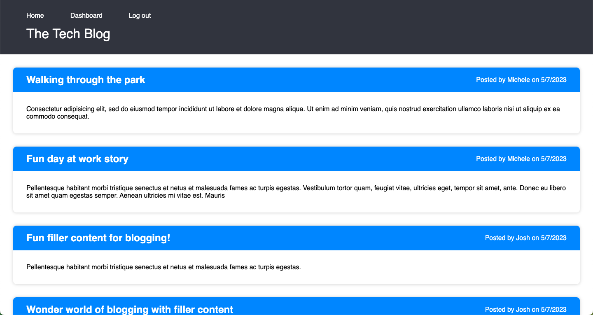

# TechBlog

## Description

Full stack MVC application that allows users to create an account, create posts, comment on posts, and edit/delete their own posts and.

It is a Tech Blog where developers can publish their blog posts and comment on other developers’ posts as well. This application follows the MVC paradigm in its architectural structure, using Handlebars.js as the templating language, Sequelize as the ORM, and the express-session npm package for authentication.

## Badge

## Table of Contents

- [Installation](#installation)
- [Usage](#usage)
- [Screenshot](#screenshot)
- [Heroku Link](#heroku-link)
- [License](#license)
- [Contributing](#contributing)
- [Tests](#tests)
- [Questions](#questions)
- [Badges](#badges)
- [Sources](#sources)

## Installation

run npm install to install all dependencies and then run npm start to start the server.

## Usage

You can use the TechBlog application to create an account, create posts, comment on posts, and edit/delete your own posts.

## Screenshot

## Heroku Link

[Link to working example](https://techblog123.herokuapp.com/)

## License

[GPL](https://api.github.com/licenses/gpl-3.0)

## Contributing

To contribute, please fork the project and create a feature branch.

## Tests

This project has no test instructions

## Questions

Github Username: xclusive36  
Github Profile: [Github Profile](https://github.com/xclusive36/)  
Any additional questions, please reach out to me by email:  
Email: [Email](mailto:xclusive36@gmail.com)

## Sources

- [Express](https://expressjs.com/)  
  Fast, unopinionated, minimalist web framework for Node.js

- [Express-Handlebars](https://www.npmjs.com/package/express-handlebars)  
  A Handlebars view engine for Express which doesn't suck.

- [MySQL2](https://www.npmjs.com/package/mysql2)  
  MySQL client for Node.js with focus on performance. Supports prepared statements, non-utf8 encodings, binary log protocol, compression, ssl much more

- [Sequelize](https://sequelize.org/)  
  Sequelize is a promise-based Node.js ORM for Postgres, MySQL, MariaDB, SQLite and Microsoft SQL Server. It features solid transaction support, relations, eager and lazy loading, read replication and more.

- [Dotenv](https://www.npmjs.com/package/dotenv)  
  Dotenv is a zero-dependency module that loads environment variables from a .env file into process.env.

- [bcrypt](https://www.npmjs.com/package/bcrypt)  
  A library to help you hash passwords.

- [Connect-Session-Sequelize](https://www.npmjs.com/package/connect-session-sequelize)  
  A connect or express middleware to keep session alive in sequelize.

- [Express-Session](https://www.npmjs.com/package/express-session)  
  Create a session middleware with the given options.
